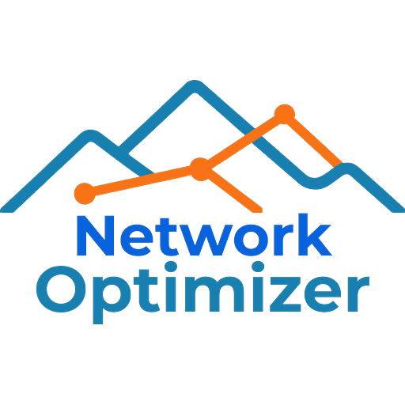
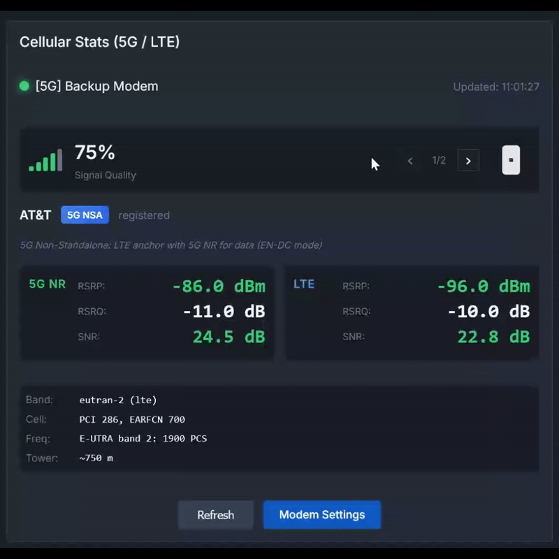

<p align="center">
  
</p>

# Network Optimizer for UniFi

[](https://github.com/Ozark-Connect/NetworkOptimizer/releases)
[](https://github.com/orgs/Ozark-Connect/packages?repo_name=NetworkOptimizer)
[](https://github.com/Ozark-Connect/NetworkOptimizer/releases)
[](https://github.com/Ozark-Connect/NetworkOptimizer/commits)
[](https://github.com/Ozark-Connect/NetworkOptimizer/stargazers)
[](https://github.com/Ozark-Connect/NetworkOptimizer/blob/main/LICENSE)

> **Notice:** This project is under rapid development. For the latest fixes and features, either pull the latest Docker image (`docker compose pull && docker compose up -d`) or [update from source](docker/DEPLOYMENT.md#upgrade-procedure). Releases and main are stable, but be careful testing any new feature branches you might find.

## New: Signal Map

Draw your building layout, place APs, and see a real-time RF propagation heatmap. The floor plan editor supports wall materials (drywall, concrete, glass, etc.), multi-floor buildings with cross-floor signal propagation, and per-AP antenna patterns pulled from your UniFi controller. Simulate TX power and antenna mode changes to see how they'd affect coverage before touching your actual config.

## New: WAN Speed Test

Test your internet connection speed directly from the server using Cloudflare's speed infrastructure. Measures download, upload, and loaded latency (bufferbloat detection) with per-WAN connection tracking. Results are displayed in a time-series chart with filter badges for multi-WAN setups, so you can compare providers over time.

## New: Wi-Fi Optimizer

Site health scoring, RF environment analysis, channel optimization, client stats, roaming tracking, band steering, and airtime fairness across twelve analysis tabs. All recommendations include specific UniFi UI paths for applying changes.​​​​​​​​​​​​​​​​

## New: Proxmox LXC Installation

Deploy on Proxmox with a single command. Run this on your Proxmox VE host:

```bash
bash -c "$(wget -qLO - https://raw.githubusercontent.com/Ozark-Connect/NetworkOptimizer/main/scripts/proxmox/install.sh)"
```

The interactive script creates a Debian 12 LXC container with Docker pre-configured. See [Proxmox Guide](scripts/proxmox/README.md) for details.

## New: macOS Native Installation

Install natively on macOS for maximum speed test performance (Docker Desktop limits network throughput for speed testing). See [macOS Installation Guide](docs/MACOS-INSTALLATION.md) for full instructions.

## New: Windows Installer

Download the MSI installer from [GitHub Releases](https://github.com/Ozark-Connect/NetworkOptimizer/releases) for one-click installation on Windows. Includes automatic service setup, bundled iperf3, OpenSpeedTest for browser-based speed tests, and runs at system startup.

## New: Client-Based LAN Speed Testing

Test LAN speeds from any device on your network - phones, tablets, laptops - without SSH access. Run browser-based speed tests powered by [OpenSpeedTest™](https://openspeedtest.com) or use iperf3 clients; results are automatically collected and displayed with device identification, network path visualization, and performance metrics. With HTTPS enabled, browser tests can collect location data (with permission) to build a Speed / Coverage Map showing real-world performance across your property or campus.


---

You've set up VLANs, configured firewall rules, maybe even deployed a Pi-hole for DNS filtering. The UniFi controller gives you all this power, but it never actually tells you whether your configuration is any good. Are your firewall rules doing what you think they're doing? Is that IoT VLAN actually isolated, or did you miss something? When a device bypasses your DNS settings and phones home directly, would you even know?

Network Optimizer answers those questions. It connects to your UniFi controller, analyzes your configuration, and tells you what's working, what's broken, and what you should fix. No more guessing.

## Main Features

### Wi-Fi Optimizer

This feature brings comprehensive wireless network analysis to Network Optimizer. Twelve tabs cover everything from a 0-100 site health score and RF environment scanning to per-client signal history, roaming event timelines, and airtime fairness breakdowns. Channel recommendations use overlap-aware scoring against the full channel span at your AP’s configured width, pull available channels from the UniFi API so suggestions match what your country and hardware actually support, and filter to Preferred Scanning Channels on 6 GHz.

On the client side, you get a sortable, searchable table view with online/offline filtering, per-client signal and roaming history, and band-segmented Wi-Fi generation breakdowns showing exactly where your airtime is going. Environmental correlation heatmaps surface interference patterns by time of day and day of week, and every recommendation includes the specific UniFi Network UI navigation path to apply the change - no guessing which settings page to dig through.​​​​​​​​​​​​​​​​

### Security Auditing

The audit engine runs 63 security checks across five categories and scores your network 0-100. This isn't a checkbox audit that just confirms you have a firewall; it actually analyzes what your rules do and whether they're doing it correctly.

Firewall analysis catches the subtle stuff: rules that shadow each other, allow rules that subvert your deny rules, allow rules that punch holes through your network isolation. VLAN security checks whether your IoT devices and cameras are actually on the networks you intended (using UniFi fingerprints, MAC OUI lookup, and port naming patterns). DNS security validates your DoH configuration, checks for bypass routes (including DoT, DoQ, and HTTP/3 DoH bypass), and verifies that your WAN interface DNS settings match what you configured. Port security looks at MAC restrictions, port isolation, and whether you've left unused ports enabled. UPnP analysis flags enabled UPnP, exposed privileged ports, and static port forwards you may have forgotten about.

You get a score, a breakdown by severity (critical, recommended, informational), and specific recommendations for each issue. Dismiss false positives if your setup is intentional, export PDF reports for documentation, track your score over time.

### Adaptive SQM

If you're on cable, DSL, or cellular, you know bufferbloat. That lag spike when someone starts a download or joins a video call. SQM fixes it, but setting the bandwidth limits correctly is a guessing game; too high and SQM can't shape traffic effectively, too low and you're leaving speed on the table.

Network Optimizer handles this automatically. It supports dual-WAN with independent configuration per interface, connection profiles tuned for DOCSIS, fiber, wireless, Starlink, and cellular (each has different characteristics that matter). Scheduled speedtests adjust your rates based on actual measured performance. Latency monitoring backs off when congestion appears. One-click deployment pushes the configuration to your UDM or UCG gateway with persistence through reboots.

### LAN Speed Testing

Ever wonder if that new switch is actually delivering 10 gigabit speeds? Or whether the cable run to the shop is the bottleneck?

Network Optimizer runs iperf3 tests between your gateway and network devices, auto-discovers UniFi equipment from your controller, supports custom devices with per-device SSH credentials, auto indexes iperf3 results from tests initiated by other devices against the built in server (if enabled), and correlates results with hop count and infrastructure path, with detailed Wi-Fi stats and link speeds recorded along with UniFi firmware versions.

Test history lets you track performance over time with these relevant data in order to identify and characterize any changes to performance.


### Client Speed Testing

Test LAN speeds from any device without SSH access. Open a browser on your phone, tablet, or laptop and run a speed test; results are automatically recorded with device identification. For CLI users, the bundled iperf3 server accepts client connections and logs results. See [Client Speed Testing](docker/DEPLOYMENT.md#client-speed-testing-optional) in the deployment guide.


### Cellular Modem Monitoring

If you're running a U-LTE or U5G-Max for backup (or primary) connectivity, you can monitor signal quality from the dashboard: RSRP, RSRQ, SNR, cell tower info, and connection status. Supports multiple modems with easy navigation between them.



### UPnP Inspector

Ever wonder what ports your network is actually exposing to the internet? Your Xbox, Plex server, and smart home devices are all punching holes through your firewall via UPnP, and UniFi doesn't make it easy to see what's going on.

The UPnP Inspector puts it all in one place: every dynamic UPnP mapping and static port forward, grouped by device, with color-coded status so you can see at a glance what's active, what's idle, and what's about to expire. Add notes to remember what each mapping is for (because you will forget). Search and filter when you're hunting for that one port that's causing problems.

### Coming Soon

Time-series metrics with historical trending and alerting. Cable modem stats (signal levels, uncorrectables, T3/T4 timeouts) for those of you fighting with your ISP about line quality.

## Requirements

**Basic (Security Audit only):**
- UniFi OS device (UDM, UCG, UDR, or Cloud Key) or self-hosted UniFi Network Server
- Network access to your UniFi controller API (HTTPS)

**Full Functionality (Adaptive SQM, LAN Speed Testing):**
- SSH access enabled on your UniFi gateway and devices (configured via web interface, not mobile app)
- **Console SSH:** Settings > Control Plane > Console > SSH
- **Device SSH:** UniFi Devices > Device Updates and Settings > Device SSH Settings
- See [Deployment Guide](docker/DEPLOYMENT.md#unifi-ssh-configuration) for detailed instructions (UniFi Network 9.5+)

Without SSH access, Security Audit works fully, but you cannot run gateway/device LAN speed tests or deploy Adaptive SQM configurations.

## Installation

| Platform | Method | Guide |
|----------|--------|-------|
| Windows | Installer (recommended) | [Download from Releases](https://github.com/Ozark-Connect/NetworkOptimizer/releases) |
| Linux Server | Docker (recommended) | [Deployment Guide](docker/DEPLOYMENT.md) |
| Proxmox VE | LXC one-liner | [Proxmox Guide](scripts/proxmox/README.md) |
| Synology/QNAP/Unraid | Docker | [NAS Deployment](docker/DEPLOYMENT.md#2-nas-deployment-docker) |
| macOS | Native (best performance) | [macOS Installation](docs/MACOS-INSTALLATION.md) |
| Linux | Native (no Docker) | [Linux Native](docker/NATIVE-DEPLOYMENT.md#linux-deployment) |

Docker Desktop on macOS and Windows limits network throughput for speed testing. For accurate multi-gigabit measurements, use native deployment.

### Quick Start (Linux Docker)

**Option A: Pull Docker Image (Recommended)**

```bash
mkdir network-optimizer && cd network-optimizer
curl -o docker-compose.yml https://raw.githubusercontent.com/Ozark-Connect/NetworkOptimizer/main/docker/docker-compose.prod.yml
curl -O https://raw.githubusercontent.com/Ozark-Connect/NetworkOptimizer/main/docker/.env.example
cp .env.example .env
docker compose up -d

# Check logs for the auto-generated admin password
docker logs network-optimizer 2>&1 | grep -A5 "AUTO-GENERATED"
```

**Option B: Build from Source**

```bash
git clone https://github.com/Ozark-Connect/NetworkOptimizer.git
cd NetworkOptimizer/docker
cp .env.example .env
docker compose build
docker compose up -d

# Check logs for the auto-generated admin password
docker logs network-optimizer 2>&1 | grep -A5 "AUTO-GENERATED"
```

Open http://localhost:8042

### Quick Start (Proxmox)

```bash
bash -c "$(wget -qLO - https://raw.githubusercontent.com/Ozark-Connect/NetworkOptimizer/main/scripts/proxmox/install.sh)"
```

### First Run

1. Go to Settings and enter your UniFi controller URL
2. Create a **Local Access Only** account on your controller (Ubiquiti SSO won't work):
   - Quick: Super Admin role
   - Restricted: Network View Only, Protect View Only, User Management None
   - See the in-app setup guide or [detailed instructions](docker/DEPLOYMENT.md#unifi-account)
3. Click Connect to authenticate
4. Navigate to Audit to run your first security scan

## Project Structure

```
src/
├── NetworkOptimizer.Web        # Blazor web UI
├── NetworkOptimizer.Audit      # Security audit engine
├── NetworkOptimizer.UniFi      # UniFi API client
├── NetworkOptimizer.Storage    # SQLite database
├── NetworkOptimizer.Monitoring # SNMP/SSH polling
├── NetworkOptimizer.Sqm        # Adaptive bandwidth management
├── NetworkOptimizer.Agents     # Agent deployment
└── NetworkOptimizer.Reports    # PDF/Markdown generation
```

## Tech Stack

.NET 10, Blazor Server, SQLite, iperf3, SSH.NET, QuestPDF

## Status

All core functionality is working and tested on many combinations of UniFi Gateways, CloudKeys, and network fabric devices. Features shown in the app are all fully functional and ready to use, with enhancements and fixes being rolled out regularly.

In progress: Time-series metrics, cable modem monitoring, WiFi analysis, multi-site support.

## Contributing

If you find issues, report them via GitHub Issues. Include your UniFi device models and controller version. Sanitize credentials and IPs before attaching logs.

## License

Business Source License 1.1

**Licensor:** Ozark Connect

**Licensed Work:** Network Optimizer for UniFi

**Personal Use:** You may use the Licensed Work for personal, non-commercial purposes on up to three sites.

**Commercial Use:** Use by managed service providers (MSPs), network installers, IT consultants, or any entity using this software in the delivery of paid services requires a commercial license.

**Change Date:** January 1, 2028

**Change License:** Apache License 2.0

For commercial licensing inquiries, contact tj@ozarkconnect.net.

© 2026 Ozark Connect

## Support

- Issues: [GitHub Issues](https://github.com/Ozark-Connect/NetworkOptimizer/issues)
- Documentation: See component READMEs in `src/` and `docker/`
